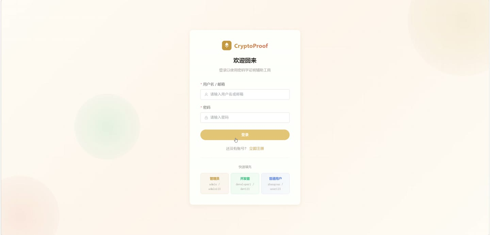
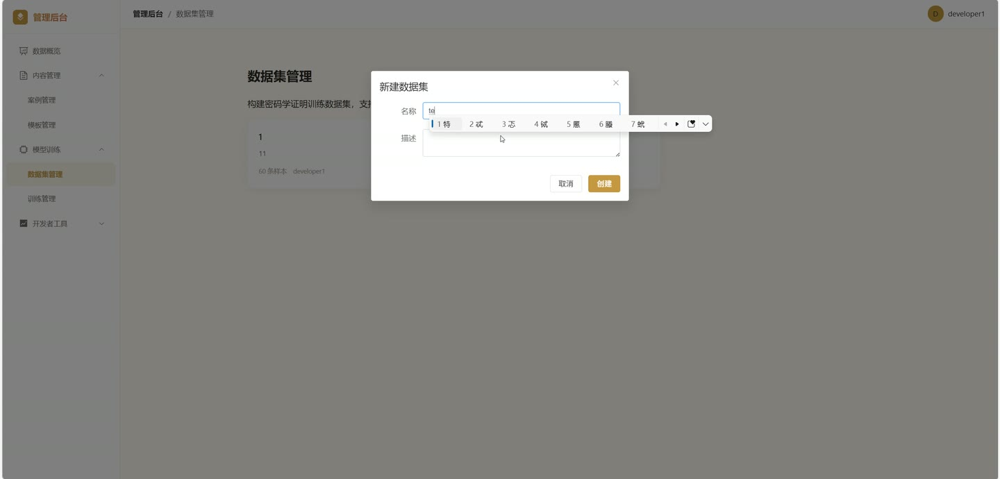
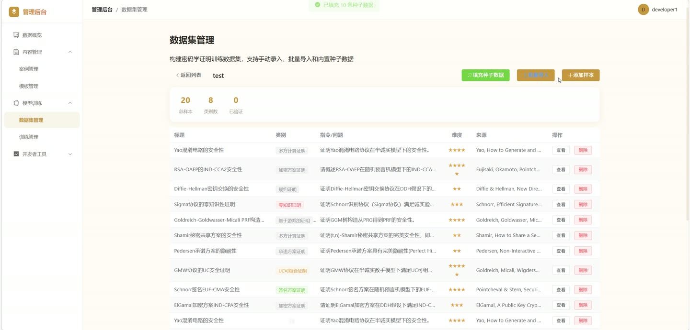
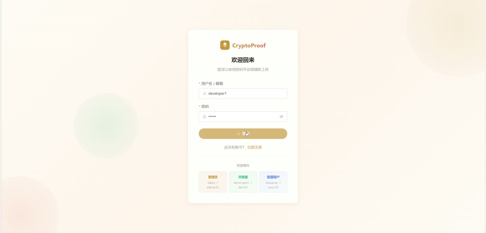
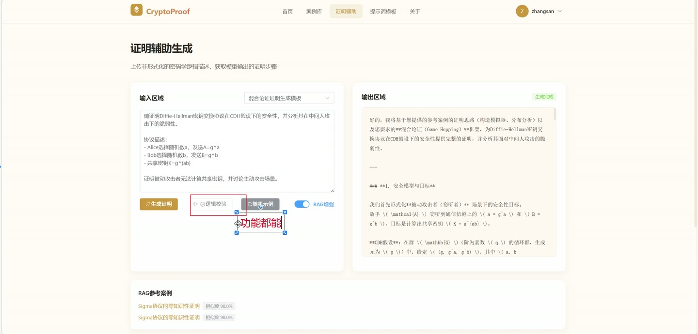

# (附文档)Python+深度学习+Django 基于大语言模型的密码学规约与可组合安全证明辅助工具

**技术栈**：Python、Django、深度学习、Vue3、MySQL

### 系统简介

本系统是一套基于大语言模型的密码学规约与可组合安全证明辅助工具，采用前后端分离架构，后端基于 Django REST Framework 提供 API 服务，前端基于 Vue3 构建单页应用。系统面向研究者、工具开发者与系统管理员三类角色，提供证明案例库、提示词模板库、AI 证明生成、证明逻辑校验、数据集与训练任务管理、语义检索与审计日志等能力。
 
### 核心功能
 
### 普通用户端

 
- 注册与登录：支持用户名/邮箱登录，登录成功返回 JWT Token 与用户信息，账号被禁用时拦截登录。 
- 个人资料维护：查看与编辑个人资料，支持上传头像、修改手机号与个人简介。 
- 修改密码：校验原密码后设置新密码。 
- 浏览公开案例：分页查看已通过审核的证明案例，支持按证明类型（规约证明/可组合安全证明）与标题关键词筛选。 
- 查看案例详情：查看案例标题、描述、证明内容、证明背景、逻辑框架、适用场景、逻辑要点与封面图，访问时自动累加浏览量。 
- 浏览公开模板：分页查看已通过审核的提示词模板，支持按证明类型与模板名称关键词筛选。 
- 查看模板详情：查看模板名称、描述、内容、分类与使用次数。 
- 使用模板生成证明：选择已通过审核的模板，将输入内容替换模板中的占位符并提交生成任务，模板使用次数自动累加。 
- AI 证明生成：输入证明描述提交生成任务，可选是否启用 RAG 检索，后台异步调用大语言模型生成证明文本。 
- 证明逻辑校验：提交证明步骤，系统结合漏洞检索上下文调用大模型输出逻辑完整性分析、发现的问题与改进建议。 
- 任务状态轮询：按任务类型与任务 ID 轮询生成或校验任务的状态与结果，生成任务返回关联的 RAG 引用案例列表。 
- 生成历史与校验历史：分页查看本人历史生成记录与校验记录。 
- 收藏管理：对案例与模板进行收藏、取消收藏，分页查看收藏列表并展示标题与描述。 
- 学习笔记：创建、查看、修改、删除本人笔记，支持按关联案例筛选，并可查看某案例下的全部笔记。 
- 语义搜索：输入关键词对案例或模板进行向量语义检索，返回相似结果。 
- 开发者申请：提交开发资质描述与附件申请成为开发者，查看本人历史申请记录与审核状态。
 
### 开发者端

 
- 案例管理：分页查看本人创建的案例，支持按状态与标题关键词筛选。 
- 创建案例：填写标题、描述、证明内容、证明类型、证明背景、逻辑框架、适用场景、逻辑要点并上传封面图，非管理员提交时状态被限制为草稿或待审核。 
- 编辑与删除案例：仅可操作本人案例，删除时记录审计日志。 
- 模板管理：分页查看本人创建的模板，支持按状态筛选。 
- 创建模板：填写模板名称、描述、内容、证明类型与分类，非管理员提交时状态被限制为草稿或待审核。 
- 编辑与删除模板：仅可操作本人模板。 
- 模板评估：对指定模板提交评分、准确率与评估意见，并可查看该模板的历史评估列表。 
- 数据集管理：创建数据集（名称、描述、来源、来源 URL），查看数据集列表与详情，删除数据集。 
- 样本管理：在数据集下新增、修改、删除样本，字段包含标题、类别、指令、输入上下文、期望输出、来源论文与难度，增删后自动更新数据集样本数。 
- 批量导入样本：以列表形式批量导入样本数据，返回成功导入条数。 
- 填充种子数据：为指定数据集一键写入内置种子样本。 
- 训练任务管理：创建训练任务（任务名称、模型类型、基座模型、数据集、训练轮数、批次大小、学习率），查看任务列表与详情，删除任务。 
- 启动训练任务：校验样本数不少于 5 条后启动后台训练线程，任务状态流转为数据准备中、训练中、已完成或失败。 
- 数据看板：查看本人案例总数与各状态数量、模板总数与各状态数量、生成次数、校验次数以及近 7 天生成趋势。 
- 模型分析：查看生成总数、完成数、生成成功率、校验总数、通过数、存在问题数、漏洞检出率与已通过模板数。
 
### 管理员端

 
- 全局数据看板：查看普通用户数、开发者数、已通过案例数、待审核案例数、已通过模板数、待审核模板数、生成次数、校验次数以及 RAG 案例与模板索引量。 
- 用户管理：分页查看全部用户，支持按角色、状态与用户名/邮箱关键词筛选。 
- 用户状态控制：启用或禁用指定用户账号，操作写入审计日志。 
- 开发者申请审核：分页查看开发者申请，支持按状态筛选，执行通过或拒绝并填写审核意见，通过后自动将用户角色升级为开发者。 
- 案例审核：对案例执行通过或拒绝，通过后自动将该案例写入 RAG 向量索引。 
- 案例管理：查看全部案例并支持编辑与删除。 
- 模板审核：对模板执行通过或拒绝，操作写入审计日志。 
- 模板管理：查看全部模板并支持编辑与删除。 
- 审计日志：分页查看系统操作日志，支持按操作名称模糊筛选，记录操作人、目标类型、目标 ID、详情与 IP 地址。 
- 文件上传：接收上传文件并返回可访问的文件 URL 与存储路径。
 
### 技术栈

 后端框架Python + Django + Django REST Framework 认证鉴权JWT Token 认证，基于角色的权限控制（user / developer / admin） ORMDjango ORM 模型映射，自定义 db_table 表名 数据库MySQL 大模型接入DeepSeek API（OpenAI 兼容 chat/completions 接口），支持超时与限流重试 检索增强RAG 向量索引，案例与模板语义检索 异步任务Python threading 后台线程执行生成、校验与训练任务 前端框架Vue3 + Vue Router 状态管理Pinia（useUserStore 管理 Token 与用户信息） 构建工具Vite 文件存储Django MEDIA 本地存储，支持头像、封面与附件上传
 
### 交付内容

 
- 后端完整源码 
- 前端完整源码 
- 数据库初始化脚本 
- 万字文档

## 界面展示

---

## 获取完整源码 + 万字文档

本仓库为项目介绍页。**完整前后端源码、数据库初始化脚本、万字项目文档**，请加微信 `kangkangcode`，或访问 [codekk.top](http://codekk.top) 获取。

可作课程设计 / 毕业设计参考，支持远程部署调试。